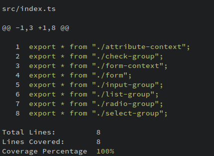

<div align="center">

# Diff Cov

Simple CLI to print diffs highlighted with test coverage status



</div>

## Installation

You can install the package with npm

```bash
npm i -g @adeattwood/diff-cov
```

You can run it directly with `npx`

```bash
npx @adeattwood/diff-cov
```

## Setup

For diff-cov to get the diff to your default branch, you must set up your
`origin/HEAD` ref. To test to see if you have this set up, run.

```bash
git rev-parse --abbrev-ref origin/HEAD
```

This should print out the origin ref to your default branch for this repo it
will print `origin/0.x`. If you get an unknown ref error, then you will need to
link `origin/HEAD` to your default branch with the below command.

```bash
git symbolic-ref refs/remotes/origin/HEAD refs/remotes/origin/0.x
```

> **Note**:
> Make sure you change `0.x` for your default branch name typically `main` or
> `development`

## Usage

Before you run `diff-cov` you must run your test suite with coverage and output
a `lcov` coverage file. You must also have all your changes committed to ensure
it's included in the output.

Once you are ready to go, you can run `diff-cov` to print your diff highlighted
with coverage status. Any line not included in the coverage report will not be
highlighted and hit and missed lines will be colored green and red. You can use
the `--coverageFile` flag to specify the path to your coverage report if its
not in the default location of `./lcov.info`

```bash
diff-cov
diff-cov --coverageFile coverage/lcov.info
```

A report is printed at the bottom and colored with a threshold of `90%`
anything below this percentage coverage will be colored red.
